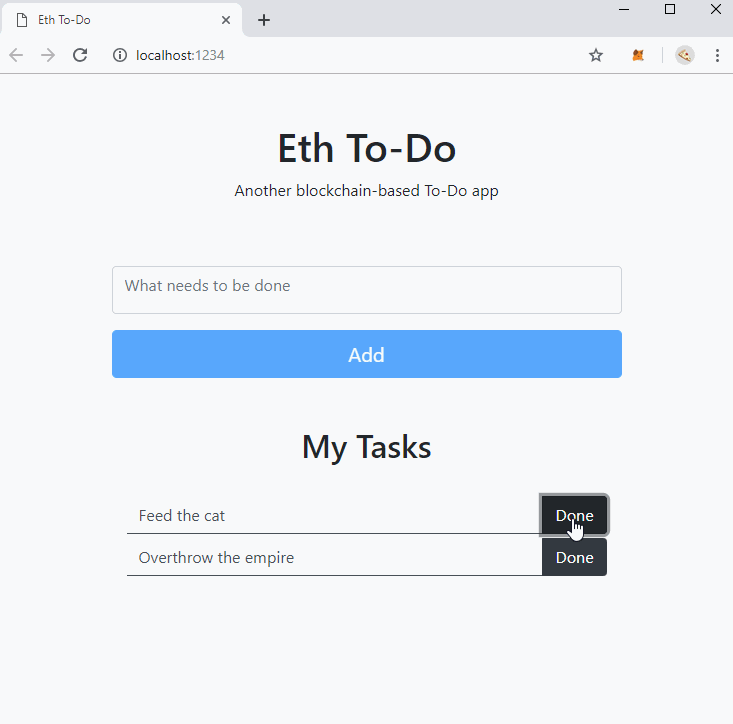

 
--
A blockchain-based To-Do SPA based on the [truffle suite](https://truffleframework.com/docs/truffle) to experiment with Ethereum smart contracts 

## Software requirements
* [Ganache](https://truffleframework.com/ganache/) - application to run a ethereum network on the localhost
* [MetaMask](https://metamask.io/) - browser extension to communicate with ethereum networks

## Installation and start
* Start Ganache with the default settings
* Start the browser with the activated MetaMask extension and select "Custom RPC" in the networks dropdown. Add Ganache's RPC Server to the "New RPC URL" field. Save and confirm
* Import any account from ganache in MetaMask using the private key
* Align [truffle.js](./truffle.js) with Ganache's RPC Server settings
* Install the package and open the SPA interface under http://localhost:1234 when the installation is done
```
npm install
```

### How does it work?

* Ganache is a ethereum Implementation designed for developers that runs locally on your machine
* The application copiles the [smart contracts](./contracts) to ethereum virtual machine bytecode and deploys it to Ganache's test network (contract calls under "transactions")
* Truffle translates the smart contracts to javascript accessible methods that are called by the web application
* Metamask provides the SPA with [web3.js](https://github.com/ethereum/web3.js/) - a javascript interface to  communicate to Ganache's Ethereum RPC endpoint that is used by truffle to pass the method calls to the ethereum network
